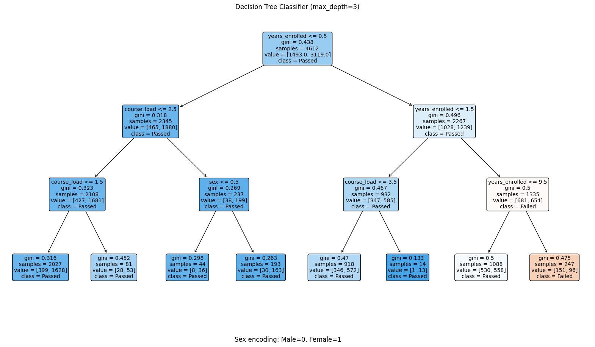
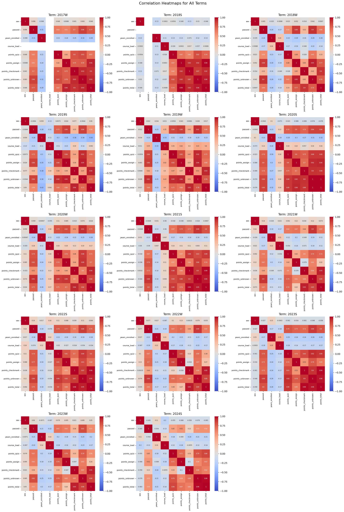
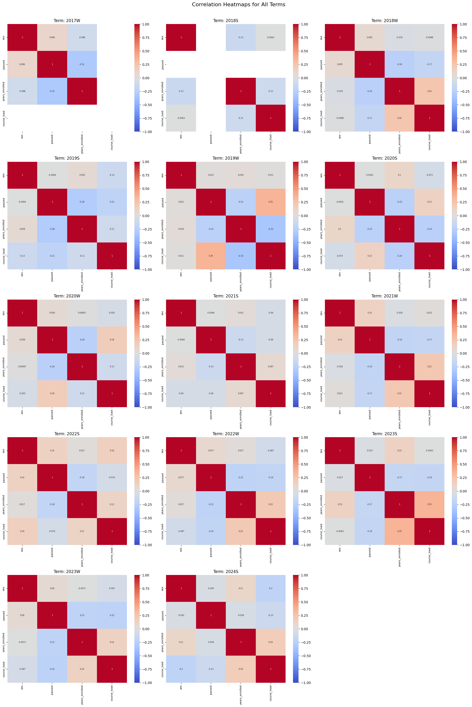
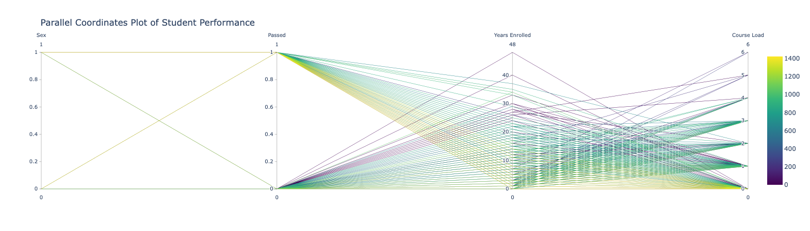
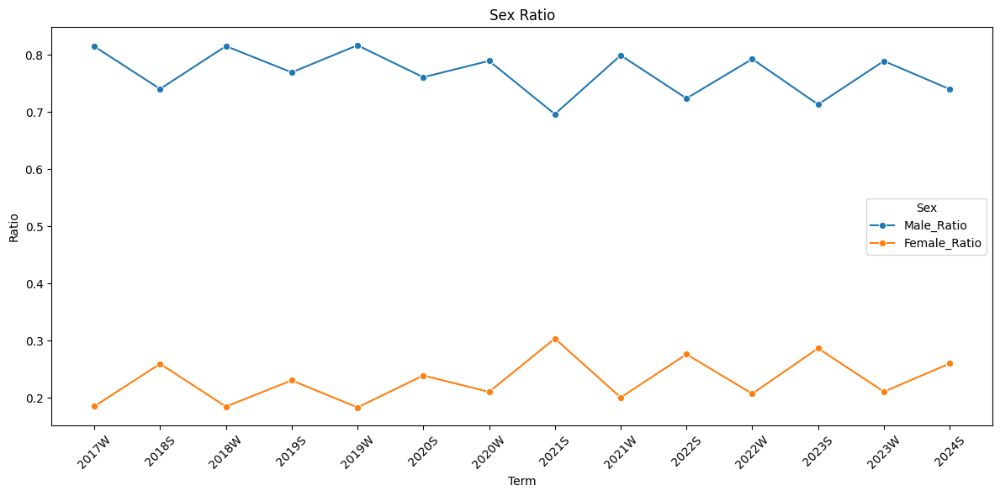
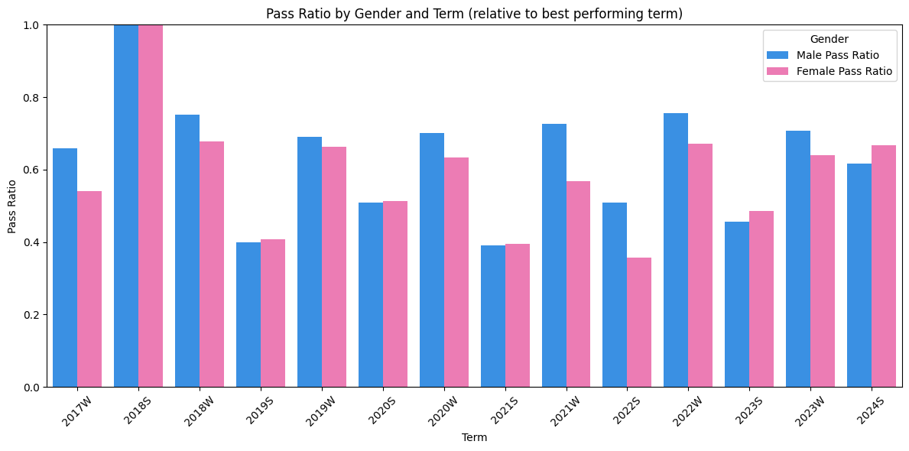
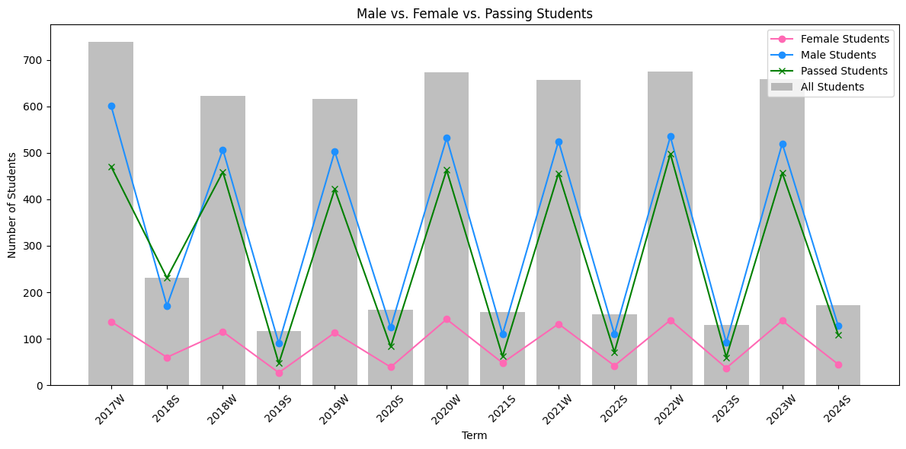
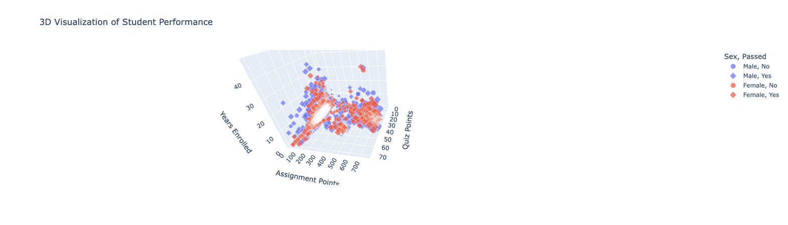
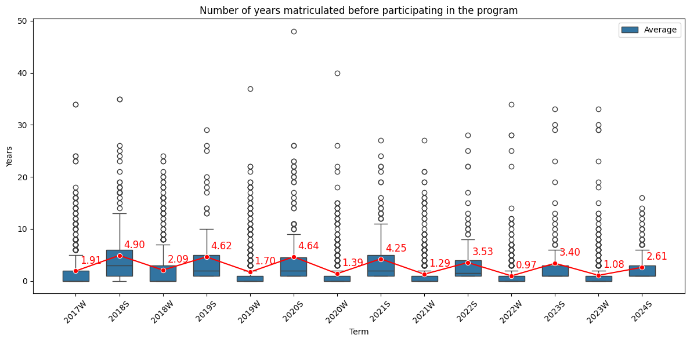
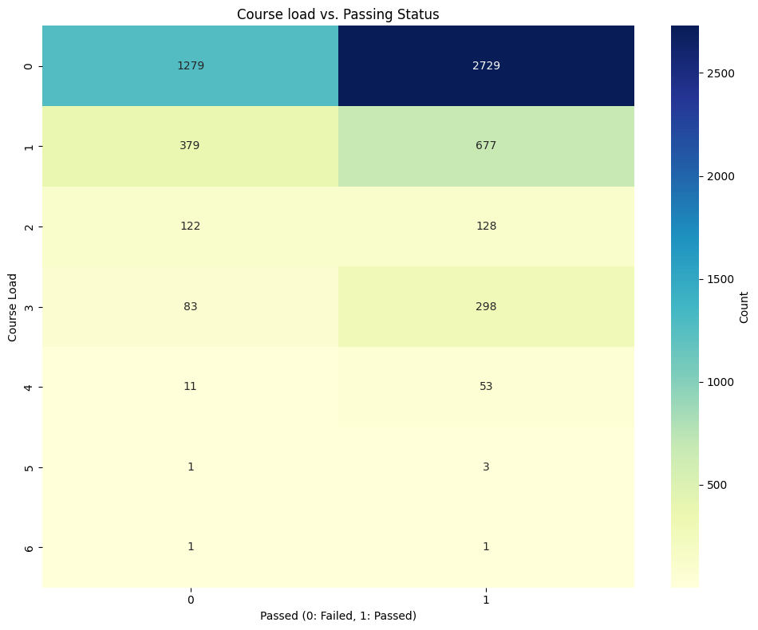

<!-- 

for config see: https://pandoc.org/chunkedhtml-demo/6.2-variables.html

$ pandoc report.md -o report.pdf && open report.pdf

-->

# 1. Choosing a data source

To begin our project, we carefully selected our data source from several available options. The TISS API[^tiss] was considered, but it offered nothing particularly exciting beyond the number of enrolled students and their final grades. It's worth mentioning that Dr. Riener later pointed out that teachers should still be able to see student gender on TISS with teacher privileges. However, they expressed ethical concerns about this feature, noting that it had recently been removed from TUWEL due to its sensitive nature.

We also evaluated the use of questionnaires for qualitative analysis. However, since participation in questionnaires is voluntary, there is a risk that overburdened or weaker students might not participate, despite their input being the most valuable as they are struggling. Additionally, the time required to conduct questionnaires is too extensive for a project of this scale.

Ultimately, we decided to use the TUWEL API[^tuwelofficial] [^tuwelstudent] as our primary data source. The TUWEL API, a Moodle fork with many custom endpoints, proved to be the most useful. It offers a comprehensive set of student data, surpassing the capabilities of the TISS API and providing a more detailed view of student performance and engagement. The API allows us to access a wide range of data, including student grades, course participation, and forum interactions. This rich dataset enables us to perform a detailed analysis of student performance and engagement in the CS1 course.

# 2. Accessing the TUWEL API

Accessing the tuwel API requires a "web service token" or "ws-token" for short[^wsmoodle] to authenticate requests which gets passed in the body of the request.

#### Token types

There are two types of tokens: temporary and permanent. The temporary token is accessible to anyone with a Tuwel account, is only valid for a few seconds and does not provide access to all endpoints our script requires. The permanent token, on the other hand, must be requested from the Tuwel admin team (currently Gergely Rakoczi[^dude]) and provides access to all endpoints we need for our study when combined with "Teacher" or "Admin" privileges. Beware that the privileges must be requested separately from the token by the admin team.

For the sake of completeness, we will explain how to obtain both tokens in the following sections although only the latter is of interest to us.

#### Security concerns

Transmitting sensitive data like API keys or passwords in plaintext within HTTP request bodies or URL parameters as implemented in the Tuwel API poses significant security risks, even when encrypted using SSL/TLS.

One major concern is that plaintext credentials in request bodies or URLs are often logged by servers, proxies and other intermediaries. These logs can potentially be accessed by unauthorized parties, leading to credential exposure. Additionally, browser history and cache may retain URLs containing sensitive parameters, increasing the risk of unauthorized access.

While HTTPS secures data in transit between the client and server, it does not protect against other attack vectors. For instance, if a malicious actor gains access to the server or intercepts the decrypted traffic at either endpoint, they can easily read the plaintext credentials. Moreover, using request bodies or URL parameters for authentication makes applications more susceptible to cross-site scripting (XSS) attacks. Attackers can potentially inject malicious scripts that capture and exfiltrate sensitive data from the request. Another vulnerability arises from the lack of built-in protection against replay attacks when using plaintext credentials in request bodies. Without proper safeguards, an attacker who intercepts a valid request could replay it to gain unauthorized access.

Furthermore, this approach may violate security best practices and compliance requirements in many industries, potentially leading to legal and regulatory issues. 
The General Data Protection Regulation (GDPR) and other data protection laws mandate the use of secure authentication methods to protect user data. Failing to comply with these regulations can result in severe penalties and reputational damage. This is particularly relevant to this service as it handles sensitive student data such as chat logs, grades and location information. Unauthorized access to such data could lead to privacy breaches, identity theft or other malicious activities targeting students.

Instead of using plaintext credentials in request bodies or URL parameters, developers should implement more secure authentication methods. OAuth 2.0, for example, provides a robust framework for secure authorization without exposing credentials. Alternatively, using authentication headers with encrypted tokens or implementing JSON Web Tokens (JWTs) can significantly enhance security.

## 2.1. Temporary token

The official walkthrough[^walkthrough] for obtaining a temporary token is as follows:

1. Log into Tuwel.
2. Open the following link in your browser:
    
    [`https://tuwel.tuwien.ac.at/admin/tool/mobile/launch.php?service=moodle_mobile_app&passport=WHATEVER`](https://tuwel.tuwien.ac.at/admin/tool/mobile/launch.php?service=moodle_mobile_app&passport=WHATEVER)
    
    As a reminder: Make sure to be logged in to Tuwel before opening the link as your session is used to generate the token. Additionally, despite what the documentation says, the `passport` (not a typo) parameter is not read by the backend and can be set to an arbitrary string.

3. Open up the developer console and look for the `Location:` header in the "network" tab, copy the token starting with `moodlemobile://token=`.
4. Base64 decodes the token and extracts the middle part (the key) split by `:::`.

The last step can be automated with the following Python function:

```python
def get_key(token: str) -> str:
    import base64
    assert token is not None
    assert token.startswith("moodlemobile://token=")
    snd = token.split("=", 1)[1]
    return base64.b64decode(snd).decode("utf-8").split(":::")[1]
```

This key can be useful for students to explore the API and see what data is available to them. However, it is not sufficient for our study as it does not provide access to all endpoints.

## 2.2. Permanent token

To retrieve the permanent token you need to:

1. Reach out to the Tuwel admin team (currently Gergely Rakoczi) and ask for both the token and the "Teacher" or "Admin" privileges.
2. Read your token from the webpage: [`https://tuwel.tuwien.ac.at/user/managetoken.php`](https://tuwel.tuwien.ac.at/user/managetoken.php)
3. Enroll in the courses you want to access the data from (or again, ask the admin team to do it for you)

To use the token with the Python script provided in the repository provided to the lecturers, simply paste it into the `config.yml` file[^gitsec].

# 3. Mining data

After having obtained the permanent token, we started mining data from the Tuwel API. This process involved selecting relevant endpoints, extracting data and preprocessing it for analysis.

#### Selecting endpoints

The first step in the data mining process is exploring the available endpoints[^tuwelstudent]. This step was particularly frustrating and time-consuming (~50% of our time budget) because the documentation only lists endpoints and required arguments without detailing the semantics of the HTTP requests or responses. The endpoints were migrated from SOAP to REST without adhering to RESTful principles, using only the HTTP `POST` method for all requests. Moreover, the endpoints are inconsistent in naming conventions and handling pagination and filtering. For instance, some endpoints require specific group IDs to retrieve data, although these IDs are undocumented and do not affect the endpoint response. In other cases, pagination is implemented by appending `[i]` (where `i` is the page number) to arguments instead of using query parameters. These are just a few examples of the numerous inconsistencies we encountered. Finally, due to the source code being a closed source fork of the original Moodle codebase, we were unable to access the source code to gain a better understanding of the inner workings of the system.

Here is how we approached the problem:

1. We began by copying all endpoint function names from the documentation into a text file. We then clustered them based on adjective-noun pairs. This helped us identify CRUD operations for most of the endpoints and gave us a partial understanding of the data model and the objects the functions work on. Since we are only interested in reading data and not modifying it, we decided to remove all endpoints that modify data / have side effects. This was crucial to maintain the integrity of the data and avoid any unintended consequences. By eliminating functions with side effects using the `_delete_`, `_update_`, `_create_`, and `_set_` infixes and consulting the official Moodle web services documentation for the ones we were unsure about [^wsmoodle], we were able to remove 165 endpoints. This left us with 255 endpoints to explore. This enabled us to reduce the 420 endpoints to a more manageable 255.

2. After removing the endpoints that modify data or have side effects, we further refined our list by eliminating endpoints that were either redundant, deprecated, not relevant or inaccessible. This meticulous process allowed us to focus on the most pertinent endpoints for our needs. We followed a systematic approach to filter out endpoints based on the following criteria:

    - Too similar: First, we identified redundant endpoints, which offered similar functionality to other endpoints but were less efficient or comprehensive.
    - Deprecated: Next, we removed deprecated endpoints, which are no longer supported or recommended for use.
    - Irrelevant: We also excluded endpoints that were not relevant to our task. These endpoints, while safe, did not provide the data we were interested in.
    - Unused: Additionally, we filtered out endpoints related to features we do not use, such as SCORM, lessons, surveys and feedback.
    - Inaccessible: Finally, we excluded endpoints that were not accessible due to permission restrictions. These included private files, recent clicks, preferences and chat messages endpoints.

    By iteratively removing these endpoints, we significantly narrowed down our list to the most relevant and useful endpoints for our project.

3. Continuing from where we left off, we now had a refined list of around 50 endpoints. The final step involved a careful selection process to determine the most suitable endpoints for our project. We focused on a few key criteria: relevance, safety and accessibility. We began by categorizing the endpoints based on their functionality, such as student-course relationships, course content, student groups, grades, quizzes, assignments and forum discussions. For each category, we evaluated the endpoints to ensure they met our needs.

    For example, in the student-course relationship category, we chose `core_grades_get_gradable_users` over `core_enrol_get_enrolled_users` to avoid fetching tutors and focus solely on students.

    We also considered redundancy and efficiency. If multiple endpoints provided similar data, we selected the most comprehensive and efficient one. For instance, `gradereport_user_get_grade_items` was chosen over `gradereport_user_get_grades_table` because it already fetched the necessary grade items.

    Finally, we verified the accessibility of each endpoint. Some endpoints required specific permissions or returned errors, so we excluded those from our final list. For example, `mod_assign_get_submission_status` was excluded due to a system error, and `core_user_get_private_files_info` was not accessible due to permission restrictions.

By following this meticulous selection process, we were able to finalize a set of endpoints that were safe, relevant and met our project requirements. This way we were left with around 20 endpoints to start mining data from. We then proceeded to chain these endpoints together to extract the necessary data for our analysis and store them in a structured format such as `.csv` or `.json` for further processing.

#### Data extraction

To extract data from the selected endpoints, we used the Python script provided in the repository provided to the lecturers. We implemented a configuration loader using `yaml.safe_load` to read API keys and other configurations from a `config.yml` file. The `fetch` function performs synchronous HTTP requests to the Moodle API, while the `fetch_async` function performs asynchronous HTTP requests. We utilized asynchronous programming techniques with `asyncio` and `aiohttp` to efficiently handle multiple API requests concurrently. This approach significantly improves the script's performance when dealing with large numbers of students and courses by reducing the time taken to fetch data by a factor of 10 or more. Due to this speedup we did however get rate limited by the API and had to wait for a few minutes before continuing and manually retry some requests for each term.

The script includes several utility functions to that chain API calls to perform complex queries otherwise not possible with a single call:

- `get_course_id(term: str) -> int`: Retrieves the course ID based on the term.
- `get_student_ids(course_id: int) -> list[int]`: Fetches a list of student IDs for a given course.
- `get_sex(name: str) -> Optional[str]`: Uses a pre-trained transformer model for gender[^gender] classification. The model has an accuracy of 100% on the test set and a reliable confidence score.
- `get_forum_participants(course_id: int) -> dict`: Gathers data on forum participants within a course. The participants can be either authors or commenters on a forum post.
- `get_student_passed(course_id: int, user_id: int) -> bool`: Determines if a student has passed a course based on their grade.
- `get_student_enrolled_courses(user_id: int) -> dict` and `get_student_grades(course_id: int, user_id: int) -> dict`: Fetch enrolled courses and grades for a student asynchronously.
- `get_student_stats(course_id: int, user_id: int) -> dict`: Combines several data points about a student into a single dictionary. We removed sensitive or unnecessary data fields to maintain privacy and focus on relevant information for analysis.

The `main` function orchestrates the entire process. It iterates over multiple terms, retrieves course IDs and fetches student IDs. It then uses asyncio's `gather` function along with `tqdm` for progress tracking to run multiple `get_stats` tasks concurrently, significantly speeding up the data collection process. This way we were able to download all the data we needed in a matter of seconds rather than hours. Additionally the use of `functools.reduce` for merging data and `aiohttp` for asynchronous HTTP requests ensures that the code is both compute-efficient and memory-efficient. The script also employs error handling and data cleaning techniques to ensure the quality and consistency of the collected information.

#### Dropouts vs. failed students

By parsing the final grade from an HTML table, we were able to differentiate between students who dropped out and those who failed the course. We defined a student as a dropout if they had a "`-`" grade and as a failed student if they had a "`N5`" grade which is an abbreviation for "Nicht Genügend" (insufficient) in German. This distinction is different to the one made in the official statistics by lecturers where only the latter gets a certificate and is considered a course participant. This is relevant for comparing our results to the official statistics as our total number of students will be higher than the one reported by the lecturers.

#### Observed vs. inferred attributes

We have to differentiate between observed and inferred attributes. Observed attributes are directly extracted from the API, such as `passed` and `current_courses`. Inferred attributes, on the other hand, are derived from the observed attributes, such as `sex` and `years_enrolled`. These inferred attributes are based on alternative data sources and are not directly available from the API. The `sex` attribute is the student's gender determined using the pre-trained transformer text-to-text model `padmajabfrl/Gender-Classification` from the Hugging Face model hub.

#### Data preprocessing

We performed an initial exploration of the extracted data using the Visual Studio Code extension 'Data Wrangler' to understand its structure and identify potential patterns. This exploration included examining variable distributions and relationships.

Following the initial exploration, we implemented a series of data preprocessing functions in Python to refine and structure the data. We started by creating helper functions to strip whitespace from string values and remove unnecessary 'id' fields from the data. We then developed a function to extract the enrollment year from matriculation numbers, which was crucial for calculating the number of years a student had been enrolled.

We proceeded to process the course information for each student. This involved removing redundant or uninformative fields, labeling courses as 'before', 'current', or 'after' relative to the term being analyzed, and filtering out specific courses such as those with the 'EP1' identifier. We also isolated the current courses for each student, discarding older courses that were not stored in the Tuwel system.

For grade processing, we implemented a function to flatten the grade structure and clean up HTML formatting in grade descriptions. We then aggregated points across different grade types (quiz, assignment, checkmark, and unknown) and calculated the total points for each student. To streamline the data, we removed the original detailed grade information after aggregation.

We created a main processing function that applied all these transformations to each student's data. This function retained only the relevant keys, calculated the years enrolled, and applied the course and grade processing steps. We also implemented utility functions for printing JSON data and displaying the structure of nested dictionaries, which were helpful for debugging and verification purposes.

Finally, we developed a function to process data for a specific term, ensuring that only valid terms were used and that all required keys were present in the student data. This function applied the processing steps to each student's data, resulting in a cleaned and structured dataset ready for further analysis.

Throughout this preprocessing stage, we focused on removing unnecessary information, standardizing data formats, and creating derived variables that would be useful for our subsequent analysis. This careful preparation of the data laid the foundation for the analytical stages of our scientific report.

We extracted the following attributes:

- `passed [bool]`: Target variable indicating whether the student passed the course.
- `sex [str]`: Gender of the student, either "Male" or "Female", determined using a pre-trained transformer model with 100% accuracy on the test set.
- `years_enrolled [int]`: Number of years the student has been enrolled at TU Wien before taking the course, derived from the matriculation number based on Austrian matriculation number specifications.
- `current_courses [list]`: List of courses the student is currently enrolled in, excluding those with the 'EP1' identifier.
- `points_quiz [int]`: Total points obtained from TUWEL quizzes.
- `points_assign [int]`: Total points obtained from assignments.
- `points_checkmark [int]`: Total points obtained from checkmarks.
- `points_unknown [int]`: Total points obtained from unknown grade types.
- `points_total [int]`: Total points obtained across all grade types.

Having extracted and preprocessed all relevant features, we were ready to proceed with the next stage.

#### Matriculation number quirks

It's worth noting that despite the surprising statistical robustness and accuracy of our `years_enrolled` algorithm that we determined through outlier testing, there are some quirks in the data that could lead to inaccuracies. First of all, the matriculation number is not a unique identifier as it can change throughout a student's academic life. Additionally, we have observed that some students decide to delete all their personal data from the system by requesting GDPR deletion which includes their matriculation number thus breaking the functionality. Dr. Podlipnig also reported that anecdotally some students might receive a matriculation number as children or early teens because of special programs at other institutions.

There is also some room for improvement. Dr. Riener commented that we missed the opportunity to also classify students based on their institutionally assigned origin. This could have provided valuable insights into the impact of different educational backgrounds based on the University or school the student attended before enrolling at TU Wien such as an applied university ("Fachhochschule").

#### Course load

The `current_courses` attribute also known as the `course_load` is a simple count of the number of courses a student is concurrently enrolled in, excluding the CS1 course. This attribute is intended to provide a measure of the student's workload and engagement level. It is worth noting that this attribute is not a list of courses the student has ever been enrolled in but rather a list of courses the student has been enrolled in at the time the CS1 course took place. It's worth noting however that due to inaccurate timestamps in the API and difficulties in differentiating between terms as courses can span multiple terms depending on when lecturers start filling them out digitally or enable students to enroll, this attribute is not always accurate. Additionally once a student graduates from TU Wien or deletes courses they have passed from TUWEL, this attribute becomes inaccurate. This is a limitation of the data and should be taken into account when interpreting the results.

# 4. Acknowledging limitations

At this point we began to encounter several limitations that impacted the depth and breadth of our analysis. These limitations included data quality, data availability and time constraints.

#### Data quality and availability

The primary challenge was the quality and availability of data. Despite our initial expectations, we found ourselves working with a dataset that was far from ideal for meaningful predictive modeling or comprehensive analysis. The data we were able to extract from the TUWEL API was largely comprised of either inaccurate and inferred values or grades that were causally linked to performance. The latter (student points), while seemingly useful, were unstructured and essentially tautological in predicting student success, as they directly determined whether a student passed or failed. This left us with a limited set of meaningful predictors to work with. Another limitation was the lack of historical or time-series data. This prevented us from developing more sophisticated predictive models that could track student progress over time. Instead, we were limited to a snapshot view of student performance, which doesn't capture the dynamic nature of learning and engagement throughout a course but rather only the final outcome. We did consider tracking individual students across multiple terms but this wouldn't have generalized well to the entire student population and would be limited to 4 terms at most.

#### Time constraints

The time constraints of the project further limited our ability to delve deeply into advanced analytical techniques or to iterate on our models and findings. Around 75% of time was consumed by data extraction and preprocessing, leaving less time for in-depth analysis and interpretation. This process was fraught with difficulties, including non-existing to inconsistent API documentation, endpoints that returned meaningless data, and the need to implement complex asynchronous request multiplexing to speed up data retrieval and multiple retries due to rate limiting. We also encountered numerous roadblocks during the data collection phase. For instance, we were unable to access certain types of data, such as quiz attempt and review data, which could have provided valuable insights into student learning processes. The structure of the data was often inconsistent or unclear, requiring significant time and effort to parse and interpret correctly.

Lastly, the time constraint implied the lack of direct access to students for qualitative insights. This meant that our analysis was purely quantitative. This limited our ability to contextualize our findings or to explore the "why" behind the patterns we observed in the data.

# 5. Building models

Due to the limitations mentioned above we decided to focus on a binary classification task to predict whether students would pass or fail the course by using inferred attributes from the time of enrollment. This approach allowed us to avoid the tautological nature of the grade data and to focus on the highly inaccurate but potentially useful inferred data that could provide more meaningful insights into student success.

Using the Scikit-Learn machine learning library we built and benchmarked multiple binary classification models to predict whether students would pass or fail. The data is split into training and testing sets using the `train_test_split` function, with 20% of the data reserved for testing. A `ColumnTransformer` is used to preprocess the data. Numeric features are standardized using `StandardScaler`, and the categorical feature `sex` is one-hot encoded using `OneHotEncoder`. Several classifiers are defined in a dictionary, including Logistic Regression, Decision Tree, Random Forest, Support Vector Machine (SVM), Naive Bayes, and K-Nearest Neighbors. Each classifier is evaluated using a pipeline that includes the preprocessor and the classifier itself. The `evaluate_model` function calculates various performance metrics, such as accuracy, precision, recall, F1 score, and ROC AUC score. These metrics are used to evaluate the performance of each model.

The following results were obtained using inferred attributes only with the Decision Tree classifier with a depth limit of 5:

```
              precision    recall  f1-score   support

           0       0.56      0.20      0.30       383
           1       0.70      0.92      0.80       770

    accuracy                           0.68      1153
   macro avg       0.63      0.56      0.55      1153
weighted avg       0.65      0.68      0.63      1153

Feature Importance:
          feature  importance
1  years_enrolled    0.884041
2     course_load    0.092899
0             sex    0.023059
```

This classifier was chosen for its interpretability and ability to visualize the decision-making process, making particularly useful in the context of educational data analysis.



Through this model we were able to achieve a 68% accuracy in predicting student success, with a precision of 70% and a recall of 92%. The model's feature importance analysis revealed that the number of years a student has been enrolled at TU Wien (`years_enrolled`) is the most significant predictor of student success, followed by the student's course load `current_courses` and the students gender `sex`.

Despite the low accuracy, the feature importance analysis provides valuable insights into the factors influencing student success. The model suggests that students who have been enrolled for a longer period are more likely to pass the course which aligns with our intuition.

The most interesting aspect of this feature is that it is accessible to anyone with a TUWEL account, making it a valuable tool and uses publicly available data to predict student success. The student's matriculation number does not fall under the GDPR as it is not considered sensitive data and the course load is a simple count of the number of courses a student is enrolled in.

This brings us to our next section where we will discuss the implications of our findings and provide actionable insights for course instructors.

# 6. Conclusion

The limitations mentioned in chapter 4 have significantly narrowed the scope of our analysis and the robustness of our findings. While we were able to extract some insights, the project ultimately highlighted the challenges of working with real-world educational data and the need for more comprehensive and structured data collection methods in educational settings.

#### Actionable insights

The immediate implication of our findings are that the number of years a student has been enrolled at an academic institution is the most significant predictor of course performance out of all the features we could infer. Using the following algorithm a lecturer could cluster students by seniority and provide additional support to students who have been enrolled for a longer period of time:

```python
def get_enrollment_year(matriculation_number: str) -> int:
    from datetime import date
    current_year = date.today().year
    matriculation_number = matriculation_number.strip()
    if len(matriculation_number) == 8:
        out = int(matriculation_number[1:3])
        # institution = matriculation_number[:1]
    elif len(matriculation_number) == 7:
        out = int(matriculation_number[0:2])
        # institution = matriculation_number[:3]
    else:
        raise ValueError("invalid matriculation number")
    if out > (current_year % 100):
        out += 1900
    else:
        out += 2000
    return out

print(get_enrollment_year("11912007"))
>>> 2019
```

#### Time budgeting

We spent a total of 125 hours on the project, distributed across various phases. Initially, 12 hours were dedicated to defining objectives and writing the proposal. We then invested 21 hours in selecting and analyzing TUWEL endpoints. The data mining phase consumed 35 hours, involving the implementation of retrieval scripts and data collection. Another 35 hours were allocated to preprocessing, analysis, visualization, and model building. We dedicated 4 hours to presenting our findings and rewriting the proposal. Finally, 18 hours were spent on report writing and poster design, including integrating feedback and creating plots to communicate our findings effectively.

#### Domain Specific Lectures

The chosen domain specific lectures are yet to be done in the following term.

#### Outlook

Future work in this area would benefit from closer collaboration with course administrators to ensure access to more comprehensive and accurate data, as well as from a longer project timeline to allow for more thorough analysis and interpretation of results.

The outlook for future work in this area however is promising and offers several avenues for exploration that could yield valuable insights into student performance and engagement. These include:

- Manual data validation: After presenting our findings to Dr. Podlipnig and Dr. Riener they among other things noticed that the Tuwel API and web application results do not match up. For instance the API call `core_enrol_get_users_courses` returns the wrong number of courses for most students. Although unfortunate, we're happy that the high interpretability of our decision tree model allowed us to catch this issue. This issue can only be resolved through collaboration with the TUWEL admin team.

- Implementing a time-series analysis by setting an arbitrary cut-off point throughout all terms: This timestamp could be used to differentiate between exercises completed before and after the cut-off point, allowing for a more detailed analysis of student progress over time and several snapshots that ultimately allow for time-series analysis. We weren't able to find the mentioned timestamps in the API documentation but it is still worth exploring.

- Adapting the script to manually add expert knowledge for individual terms: This could involve incorporating additional data sources or expert insights to enhance the model's predictive power and provide more accurate results. One such data source could be the official TUWEL service website which provides excel sheets that are well-structured and the default medium for lecturers to store grades.

- Automating the process for other courses: By developing a more generalized data extraction and analysis pipeline, we could apply the same methodology to other courses and institutions, providing valuable insights into student performance and engagement across a wider range of educational settings. This could enable the entire TU Wien to benefit from the insights gained in this project.

- Implementing fairness metrics: By incorporating fairness metrics into the model evaluation process, we could assess sexism and fairness in the grading system. This could help identify and address potential biases in the grading process and ensure that all students are treated fairly and equitably.

- Adding check-in points: By incorporating random checkpoints throughout the course that are not graded, we could assess student engagement and understanding more effectively. This could provide valuable insights into student progress and help identify areas where additional support is needed and enable students to track their progress more effectively while being provided with additional support to prepare for their exams.

- Using the number of attempts per quiz as a feature: By incorporating the number of attempts per quiz as a feature, we could assess student engagement and understanding more effectively. Too many attempts could indicate a lack of understanding, while too few could indicate a lack of engagement. This could provide valuable insights into student learning processes and help identify areas where additional support is needed.

In conclusion this project was a valuable learning experience, and we gained insights into the challenges of working with educational data. While there is still considerable work to be done to enhance data quality and availability, the potential for utilizing data-driven approaches to improve teaching strategies and student outcomes remains promising. To ensure result reproducibility and ease of development, we locked dependencies using `pip-compile`. The code for this project, written in Python and leveraging the Scikit-Learn library for machine learning tasks, has been securely stored in an internal GitLab repository and is available upon request. We anticipate that future projects will be able to build upon our codebase with ease, as it serves as a solid foundation. It is our sincere hope that our findings will make a meaningful contribution to the ongoing efforts aimed at improving student outcomes and retention rates in introductory programming courses at TU Wien.

# Addendum: Data Visualization

To provide a comprehensive overview of the data and model results, we developed various visualizations using the `matplotlib` and `seaborn` libraries.

The following visualizations were created to gain an intuitive understanding of the data and and variable relationships.



















[^tiss]: TISS API documentation: https://tiss.tuwien.ac.at/api/dokumentation
[^tuwelofficial]: Tuwel API documentation (needs permanent ws-token): https://tuwel.tuwien.ac.at/webservice/wsdoc.php?id=10151
[^tuwelstudent]: Tuwel API documentation (accessible to anyone): https://tuwel-api.github.io/student-api-documentation/all_functions.html
[^dude]: The official TUWEL service website: https://www.tuwien.at/studium/lehren-an-der-tuw/zentrum-fuer-strategische-lehrentwicklung/digital-teaching-and-learning
[^wsmoodle]: Moodle web services docs: https://docs.moodle.org/404/en/Using_web_services
[^gitsec]: Never commit [sensitive data to git](https://docs.github.com/en/github/authenticating-to-github/keeping-your-account-and-data-secure/removing-sensitive-data-from-a-repository) and always use a security tool like `git-secrets` or `gittuff` to manage secrets in your codebase. This method is not a substitute for proper security practices and was only used for the sake of simplicity. Additionally all tokens used were invalidated after the model was built.
[^walkthrough]: The official walkthrough: https://github.com/tuwel-api/student-api-documentation/blob/main/docs/getting_started.md
[^gender]: The function handle `get_sex` and the `sex` attribute in the data are misnomers and should be replaced with `gender` as it is more accurate and respectful of the students' identities. We apologize for the oversight especially in light of the political implications.
