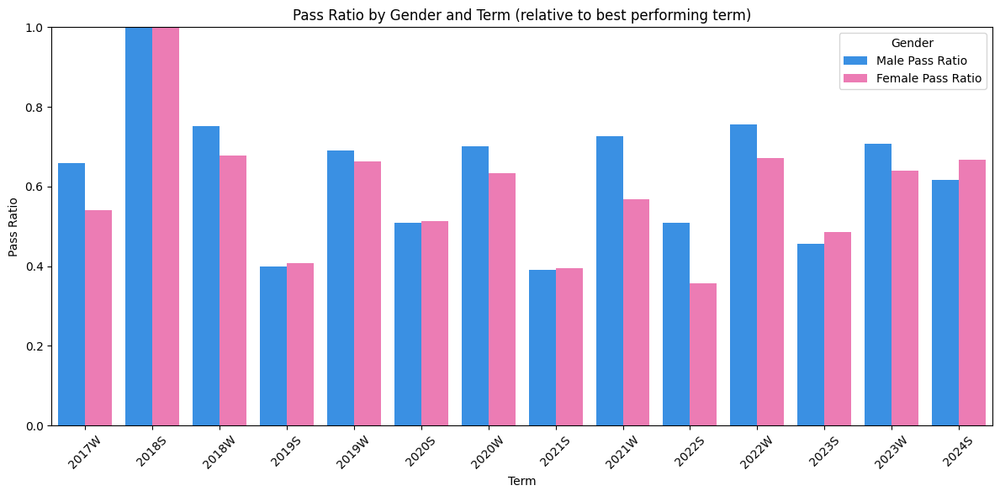

<!-- https://git.logic.at/podlipnig/ep1_analytics -->

machine learning meets computer science education @ 185.a91 ep1 in tu wien.

key findings:

- the number of years a student has been enrolled at tu wien is the most significant predictor of course performance among the attributes we found - this can be estimated from the matriculation number.
- course load and student gender are also important factors. but it turns out that the `core_enrol_get_users_courses` function in the tuwel api malfunctions and returns the wrong number of courses for most students.
- a simple decision tree with publically available and inferred attribute and a max depth of 5 achieved 68% accuracy.

limitations:

- limited data quality, availability and truthfulness
- lack of historical data
- time constraints in project execution

for a full report see the [report](./docs/report.pdf) or the [poster](./docs/poster.pdf) for a summary.

thanks to my supervisors stefan and martin for their guidance and support throughout the project!

 

