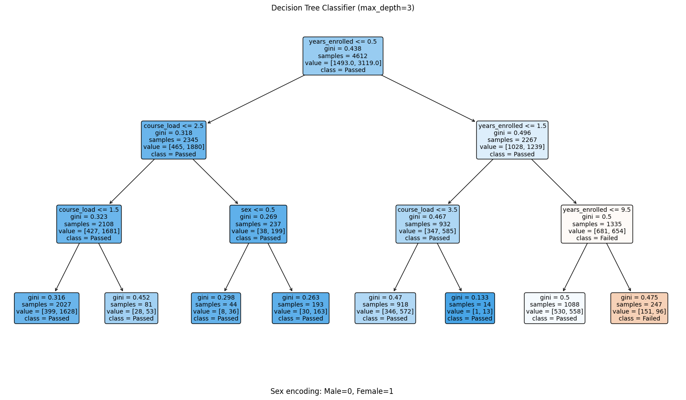

<!-- https://git.logic.at/podlipnig/ep1_analytics -->

Machine learning meets computer science education @ 185.A91 EP1 in TU Wien.

Key findings:

- The number of years a student has been enrolled at TU Wien is the most significant predictor of course performance among the attributes we found - this can be estimated from the matriculation number.
- Course load and student gender are also important factors. but it turns out that the `core_enrol_get_users_courses` function in the TUWEL API malfunctions and returns the wrong number of courses for most students.
- A simple decision tree with publically available and inferred attribute and a max depth of 5 achieved 68% accuracy.

Limitations:

- Limited data quality and availability
- Lack of historical data
- Time constraints in project execution

For a full report see the [report](./docs/report.pdf) or the [poster](./docs/poster.pdf) for a summary.

Thanks to my supervisors stefan and martin for their guidance and support throughout the project!

 

